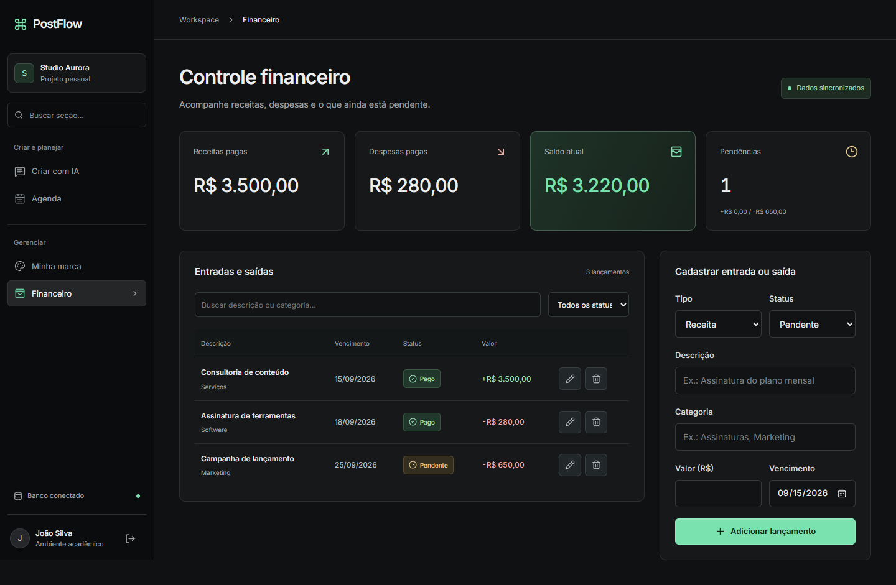
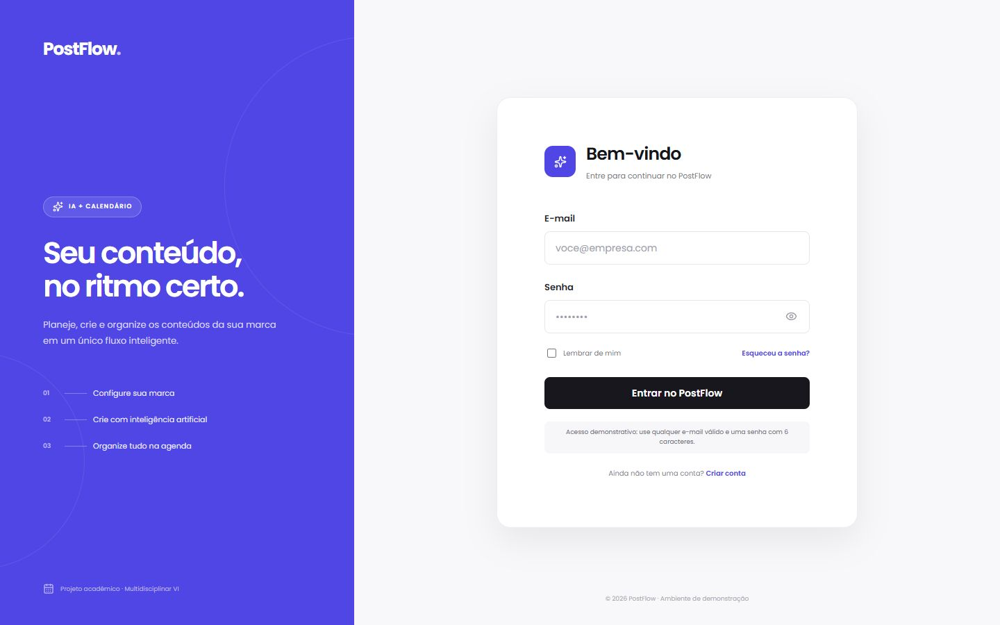
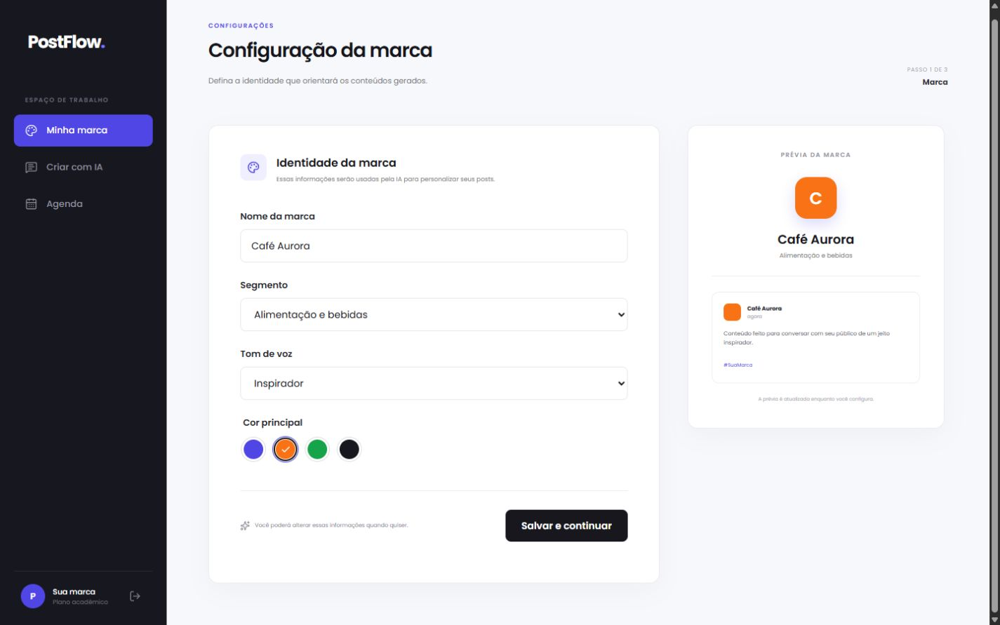
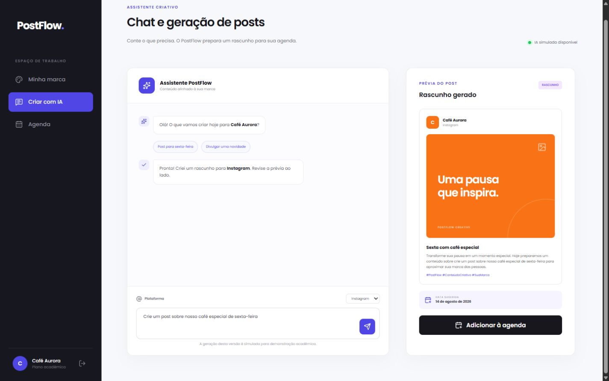
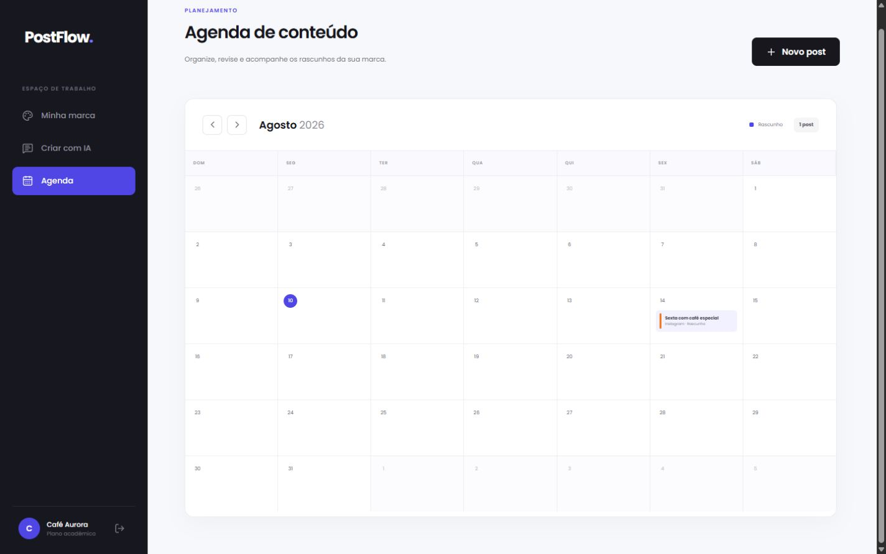

# PostFlow

Aplicação demonstrável para planejar conteúdo de redes sociais com apoio de inteligência artificial. O projeto foi desenvolvido para o **Projeto Multidisciplinar VI** e possui frontend React, autenticação Supabase Auth, API Express e banco PostgreSQL hospedado no Supabase.

> A integração de geração real está preparada em `POST /api/content/generate`.
> Antes de receber dados reais de clientes, aplique as migrations em homologação,
> execute o roteiro da [auditoria de produção](docs/production-readiness-audit.md)
> e configure os membros internos da plataforma no servidor.

Nesta versão, o cliente configura a marca, gera e agenda conteúdo e acompanha a própria assinatura. Financeiro, Fiscal e economia dos planos formam um backoffice separado, protegido por papéis internos da plataforma.

## Interface responsiva — SCRUM-49

Login, marca, chat, agenda e financeiro foram reformulados como um workspace escuro, inspirado nas referências de navegação enviadas pelo usuário. Tokens em `src/styles/tokens.css` centralizam cores, superfícies e bordas. Inter é empacotada localmente, com subconjunto latino. Cabeçalhos usam o componente `src/components/ui/PageHeader.tsx`; componentes continuam organizados por funcionalidade.

Melhorias de uso:

- Sidebar com grupos, busca de seções, rota ativa, status do banco e conta. Até 760px, um botão abre e fecha a navegação em fluxo, sem cobrir o conteúdo.
- Configuração da marca com prévia ao vivo e recuperação dos dados carregados, sem sobrescrever campos já editados.
- Chat com pedido enviado persistente na conversa, prévia separada e link para revisão. A IA continua simulada.
- Agenda com mês e lista; a lista é inicial em telas até 560px. Edição com foco contido no diálogo, Escape e restauração do foco.
- Financeiro com busca por descrição/categoria, filtro de status, histórico prioritário e registros em formato de cards no celular. Filtrar não altera os totais gerais.

Capturas em `docs/screenshots/responsive` cobrem 320, 390, 768, 1024 e 1440px com dados preenchidos. Foram produzidas com respostas de rede isoladas (sem gravar dados reais). Não representam validação de conexão em produção. O protótipo antigo do Figma não foi alterado.



Para repetir: execute `npx playwright install chromium`, inicie o Vite na porta 5173 e rode `npm run test:responsive`. Alternativamente, configure `PLAYWRIGHT_CHANNEL=chrome` ou `PLAYWRIGHT_CHANNEL=msedge` para usar um navegador instalado. A checagem cobre 30 combinações, erros de execução, overflow, navegação mobile, busca financeira e fechamento do diálogo por Escape. Use `npm test` para os 46 testes de unidade/integração e o contrato SQL. Os testes visuais usam uma marca e registros fictícios, não contas reais.

### Refinamento com frontend-design — SCRUM-50

A skill orientou a redução de rótulos decorativos, a apresentação do planejamento editorial no login e a revisão do conteúdo no próprio chat. Após gerar, edite título, legenda e data em “Revise antes de salvar”. A agenda abre no mês escolhido e confirma a inclusão do rascunho; salvar não publica em redes sociais. No financeiro, dados ainda não recebidos não aparecem como saldo zero confirmado.

O [plano e a crítica de design](docs/frontend-design-review.md) registram as decisões antes da implementação. Mantidos o estilo escuro solicitado, os serviços existentes e a IA demonstrativa; nenhuma ferramenta do Figma foi utilizada nesta revisão.

## Instalação

## Estúdio de conteúdo e fiscal — SCRUM-51 / SCRUM-52

- `/chat`: conversa com histórico da sessão, refinamento do rascunho, prévia/edição, cancelamento, retry e revisão antes de salvar. [Contrato de geração e limites](docs/content-studio.md). A demonstração não gera imagens por IA; integração real de provedor ainda pendente.
- `/billing`: plano, consumo, faturas e comprovantes do workspace atual.
- `/admin/fiscal`: receitas faturadas com imposto didático de 6%, bruto/líquido e comprovante **sem validade fiscal**.
- `/admin/finance`: receitas, despesas, saldo, pendências e pagamentos internos do PostFlow.
- `/admin/plans`: proposta de **R$ 79,90/mês**, franquias e simulador de economia. Fontes em [Fiscal e precificação](docs/fiscal-and-pricing.md).
- O fluxo demonstrativo usa `PaymentProvider` e `FiscalProvider`; não cobra nem emite NFS-e real sem adapters e credenciais próprios.

As decisões de layout foram orientadas pela skill `frontend-design`, sem Figma. Testes unitários/integração e capturas isoladas não substituem a validação do banco real. Para usar o fiscal, a tabela `financial_transactions` da migração financeira precisa existir no Supabase configurado.

### Instalação local

Requisitos: Node.js 22.14 ou superior, npm e um projeto no Supabase.

```bash
git clone https://github.com/JoaovSilva2005/PostFlow.git
cd PostFlow
npm install
npm run db:verify
npm run dev
```

Antes de executar, copie `.env.example` para `.env` e informe `VITE_SUPABASE_URL` e `VITE_SUPABASE_PUBLISHABLE_KEY`. A preparação completa está em [`database/README.md`](database/README.md).

`npm run dev` inicia a API em `http://localhost:3001` e o frontend no endereço informado pelo Vite. Crie uma conta pela própria tela ou utilize um usuário já cadastrado no Supabase Auth.

## Publicar gratuitamente na Vercel

O frontend Vite e a API Express são publicados juntos no mesmo projeto. O arquivo `api/index.ts` adapta a API para uma Vercel Function, enquanto `vercel.json` prioriza `/api/*` e mantém as rotas do React Router acessíveis por link direto.

1. Envie o repositório para o GitHub e acesse [vercel.com/new](https://vercel.com/new).
2. Importe `JoaovSilva2005/PostFlow` e mantenha a raiz do repositório como **Root Directory**.
3. A Vercel usará automaticamente `npm run build` e publicará a pasta `dist`.
4. Em **Settings > Environment Variables**, cadastre para Production, Preview e Development:

```env
VITE_SUPABASE_URL=https://SEU-PROJETO.supabase.co
VITE_SUPABASE_PUBLISHABLE_KEY=SUA_CHAVE_PUBLICAVEL
SUPABASE_URL=https://SEU-PROJETO.supabase.co
SUPABASE_PUBLISHABLE_KEY=SUA_CHAVE_PUBLICAVEL
SUPABASE_SERVICE_ROLE_KEY=SUA_CHAVE_SECRETA_DO_SERVIDOR
APP_URL=https://SEU-DOMINIO.vercel.app
```

`VITE_API_URL` deve ficar ausente na Vercel. Nesse caso, o frontend usa `/api` no mesmo domínio. Se preferir cadastrá-la, use somente `/api`. `API_PORT` também é desnecessária no deploy serverless. `APP_URL` define o endereço permitido para o retorno da recuperação de senha.

No Supabase, inclua `${APP_URL}/login` em **Authentication > URL Configuration > Redirect URLs** para que o link de recuperação volte à aplicação.

Antes de publicar, execute `database/schema.sql` e `database/seed.sql` no SQL Editor do Supabase. Depois do deploy, valide:

- `/login`: aplicação carregada e navegação funcionando;
- `/billing`: plano, consumo e faturas somente do workspace autenticado;
- `/admin/finance`: backoffice disponível somente para membro interno;
- `/api/health`: resposta JSON com `status: "ok"` e `storage: "supabase"`.

O `.env` e a pasta local `.vercel` são ignorados pelo Git. A chave publicável pode ser usada no frontend para autenticação, mas o acesso do backend aos dados utiliza exclusivamente `SUPABASE_SERVICE_ROLE_KEY` (ou `SUPABASE_SECRET_KEY`) em variável server-side. Nunca cadastre uma chave `service_role` em variável iniciada com `VITE_`, nem a exponha no navegador. A API nunca substitui a chave privilegiada pela chave pública.

## Autenticação e autorização

O login é processado pelo backend com Supabase Auth. Os tokens não são enviados no JSON nem gravados no `localStorage`: ficam em cookies `HttpOnly`, `SameSite=Lax` e `Secure` em produção.

| Método | Endpoint             | Responsabilidade                       |
| ------ | -------------------- | -------------------------------------- |
| `POST` | `/api/auth/login`    | Validar credenciais e iniciar a sessão |
| `POST` | `/api/auth/register` | Criar uma conta                        |
| `GET`  | `/api/auth/me`       | Restaurar o usuário autenticado        |
| `POST` | `/api/auth/refresh`  | Renovar a sessão                       |
| `POST` | `/api/auth/recover`  | Enviar a recuperação de senha          |
| `POST` | `/api/auth/logout`   | Encerrar a sessão e remover cookies    |

Há dois contextos independentes. `WorkspaceRole` (`owner`, `admin`, `editor`, `viewer`) vem de `brand_members` e vale somente para uma marca. `PlatformRole` (`platform_owner`, `finance_admin`, `support`) vem de `platform_members` e protege o backoffice. O frontend não escolhe nem envia sua própria role. Consulte a [tabela de permissões](docs/architecture.md#autorização-em-dois-contextos).

## APIs de cobrança e administração

| Método | Endpoint                                      | Responsabilidade                    |
| ------ | --------------------------------------------- | ----------------------------------- |
| `GET`  | `/api/health`                                 | Verificar se a API está disponível  |
| `GET`  | `/api/workspaces/:id/billing/plans`           | Planos disponíveis para contratação |
| `GET`  | `/api/workspaces/:id/billing`                 | Plano, assinatura e consumo         |
| `PUT`  | `/api/workspaces/:id/billing`                 | Contratar e gerar fatura pendente   |
| `GET`  | `/api/workspaces/:id/invoices`                | Faturas da própria marca            |
| `POST` | `/api/workspaces/:id/invoices/:invoiceId/pay` | Confirmar pagamento demonstrativo   |
| `GET`  | `/api/admin/finance/transactions`             | Listar entradas e saídas internas   |
| `GET`  | `/api/admin/finance/summary`                  | Calcular saldo e pendências         |
| `POST` | `/api/admin/finance/transactions`             | Criar lançamento interno            |
| `GET`  | `/api/admin/fiscal/report`                    | Relatório fiscal acadêmico          |

Regra do saldo: `receitas pagas - despesas pagas`. Valores pendentes são exibidos separadamente e não alteram o saldo atual.

Produção falha de forma fechada quando o Supabase está indisponível. O fallback em memória só pode ser ativado explicitamente fora de produção para demonstrações locais.

## Executar o banco de dados

No **SQL Editor** do Supabase, execute `database/schema.sql` em instalações novas. Em bancos existentes, aplique as migrations de `database/migrations` em ordem, sempre primeiro em homologação e sem apagar dados.

1. [`database/schema.sql`](database/schema.sql);
2. [`database/seed.sql`](database/seed.sql).

### Perfis de demonstração

Depois de criar e confirmar as contas no Supabase Auth, execute [`database/demo-personas.sql`](database/demo-personas.sql). O script não contém senhas e prepara três cenários isolados:

| Conta                    | Workspace              | Permissões                                             | Cobrança                    |
| ------------------------ | ---------------------- | ------------------------------------------------------ | --------------------------- |
| `admin@postflow.test`    | PostFlow Administração | `platform_owner` + `owner`; cliente e administração    | Acesso administrativo total |
| `cliente@postflow.test`  | Aurora Conteúdo        | `owner`; somente telas do cliente                      | Plano Profissional ativo    |
| `semplano@postflow.test` | Novo Cliente           | `owner`; somente contratação até ativar uma assinatura | Sem plano ou fatura         |

Contas sem plano são direcionadas para `/billing`. As rotas e APIs de marca, conteúdo e agenda exigem assinatura `active` ou `trialing`; `platform_owner` pode acessar o produto para suporte administrativo. As credenciais de demonstração devem ser mantidas fora do Git e trocadas ou removidas após a apresentação.

Depois, valide a conexão e o CRUD real:

```bash
npm run db:verify
npm run db:test-crud
```

## Verificações de qualidade

```bash
npm run typecheck
npm run lint
npm test
npm run build
```

## Arquitetura

O código usa React, TypeScript, Vite, React Router, CSS Modules, Context com `useReducer`, Node.js, Express, Zod, Supabase/PostgreSQL, Vitest e React Testing Library.

```text
api/             # adaptador serverless da Vercel
backend/
├── config/      # variáveis de ambiente e cliente Supabase da API
├── modules/     # autenticação e financeiro agrupados por domínio
├── shared/      # recursos reutilizáveis do backend
└── test/        # apoios reutilizáveis dos testes
src/
├── app/         # rotas, proteção de acesso e estado compartilhado
├── components/  # menu lateral e componentes reutilizáveis
├── domain/      # tipos e conceitos do PostFlow
├── features/    # telas, estilos, serviços específicos e testes por função
├── services/    # conexão, persistência e sessão compartilhadas
├── styles/      # tokens do Figma, fonte e estilos globais
└── test/        # configuração e utilitários de teste
database/        # schema, migrações, carga inicial e documentação do DER
scripts/         # validações da API e do banco agrupadas por finalidade
```

A explicação completa, incluindo o fluxo **tela → API → regra → banco**, está em [`docs/architecture.md`](docs/architecture.md). As pastas [`src`](src/README.md), [`backend`](backend/README.md) e [`database`](database/README.md) também possuem guias próprios.

Os nomes de arquivos, componentes e tipos estão em inglês. A interface e a documentação estão em português para manter o código técnico consistente sem prejudicar a apresentação acadêmica.

## O que é simulado

- **Inteligência artificial:** `demoGenerationService` monta um rascunho por template após um pequeno carregamento. `apiGenerationService` prepara o frontend para um endpoint de geração ainda não implementado.
- **Persistência:** marcas, posts, hashtags e lançamentos financeiros são armazenados no Supabase/PostgreSQL.
- **Publicação:** não existe integração real com redes sociais neste incremento.

Conteúdo, marca, cobrança, Financeiro e Fiscal passam pelo backend Express. A `service_role` permanece somente no servidor; toda consulta é escopada por membership ou papel de plataforma. A publicação automática fica para próximas Sprints.

## Rastreabilidade

| Figma                 | Rota                 | Componente                          | Jira       | Teste automatizado                                |
| --------------------- | -------------------- | ----------------------------------- | ---------- | ------------------------------------------------- |
| Login                 | `/login`             | `LoginPage`                         | `SCRUM-9`  | valida campos e navegação                         |
| Autenticação real     | `/api/auth`          | `authRoutes` + `AuthService`        | `SCRUM-46` | sessão, cookies e proteção de rotas               |
| Configuração da marca | `/brand`             | `BrandPage`                         | `SCRUM-12` | salva e recupera a marca                          |
| Entrada do chat       | `/chat`              | `ChatPage`                          | `SCRUM-15` | valida pedido e exibe carregamento                |
| Geração e prévia      | `/chat`              | `PostPreview` + `generationService` | `SCRUM-51` | contrato, timeout, cancelamento, revisão e agenda |
| Fiscal                | `/admin/fiscal`      | `FiscalPage` + `fiscalRoutes`       | `SCRUM-52` | imposto e comprovante acadêmico                   |
| Agenda mensal         | `/calendar`          | `CalendarPage` + `calendarUtils`    | `SCRUM-19` | apresenta cada rascunho na data correta           |
| Edição e exclusão     | `/calendar`          | `EditDraftDialog`                   | `SCRUM-20` | altera ou exclui somente o item selecionado       |
| Banco de dados        | fluxo todo           | `postFlowRepository.ts`             | `SCRUM-39` | conexão, CRUD, seed e integridade                 |
| Estrutura financeira  | `/admin/finance`     | `financial_transactions`            | `SCRUM-40` | contrato SQL, PK, FK, RLS e seed                  |
| API financeira        | `/api/admin/finance` | `financialRoutes.ts`                | `SCRUM-41` | CRUD HTTP, autorização e cálculo                  |
| Painel financeiro     | `/admin/finance`     | `FinancePage`                       | `SCRUM-42` | indicadores, formulário e histórico               |
| Documentação e testes | fluxo financeiro     | README + testes                     | `SCRUM-43` | qualidade e rastreabilidade                       |

### Ordem sugerida para apresentar o código

1. `src/app/App.tsx`: mostra as rotas das quatro telas.
2. `src/features/auth/LoginPage.tsx`: login, cadastro e recuperação.
3. `backend/modules/auth/authRoutes.ts`: entradas e saídas da autenticação.
4. `backend/modules/auth/authMiddleware.ts`: proteção e níveis de acesso.
5. `src/features/brand/BrandPage.tsx`: configuração da identidade da marca.
6. `src/features/content/ChatPage.tsx`: pedido do usuário e chamada da IA simulada.
7. `src/features/content/generationService.ts`: geração simulada e contrato HTTP.
8. `src/features/content/PostPreview.tsx`: prévia e inclusão na agenda.
9. `src/features/calendar/CalendarPage.tsx`: calendário e rascunhos por data.
10. `src/features/calendar/EditDraftDialog.tsx`: edição e exclusão do rascunho.
11. `src/services/supabaseClient.ts`: conexão por variáveis de ambiente.
12. `src/services/postFlowRepository.ts`: operações de CRUD.
13. `database/schema.sql`: tabelas, chaves, RLS, restrições e índices.
14. `database/seed.sql`: dados iniciais usados na demonstração.
15. `scripts/database/testCrud.mjs`: evidência automatizada do CRUD real.
16. `backend/modules/finance/financialRoutes.ts`: entradas e saídas da API.
17. `backend/modules/finance/financialService.ts`: cálculo do saldo e regra de status.
18. `backend/modules/finance/financialRepository.ts`: persistência no Supabase.
19. `src/features/finance/FinancePage.tsx`: tela ligada à API.
20. `backend/modules/finance/financialRoutes.test.ts`: teste de CRUD HTTP.

## Telas codificadas

### Login



### Configuração da marca



### Chat e geração de posts



### Agenda de conteúdo



### Módulo financeiro

Acesse `/admin/finance` com um membro interno autorizado para demonstrar os indicadores, o cadastro de uma entrada ou saída, a mudança de status e a atualização imediata do saldo. Clientes comuns usam `/billing`.

## Links do projeto

- [Aplicação publicada na Vercel](https://post-flow-ochre.vercel.app)
- [Protótipo no Figma](https://www.figma.com/design/lYt49rDTT6Hf568TiP9zu9)
- [Backlog no Jira](https://joaovsilva3530.atlassian.net/issues/?jql=project%20%3D%20SCRUM%20ORDER%20BY%20key%20ASC)
- [Documentação no Confluence](https://joaovsilva3530.atlassian.net/wiki/spaces/DDS/pages/2162689/PostFlow+Vis+o+Inicial+do+Projeto)

## Estado do incremento

As telas principais, a autenticação, cobrança, Financeiro e Fiscal estão codificados. O fluxo **Escolha do plano → Fatura pendente → Confirmação do pagamento → Receita → Fiscal → Comprovante** passa pelo backend e preserva a separação entre cliente e backoffice. O schema possui memberships, planos, assinaturas, consumo, faturas, livro financeiro e snapshots fiscais com testes automatizados. O adapter atual é demonstrativo e não movimenta dinheiro real.
