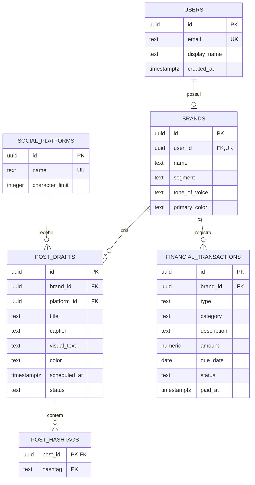

# Banco de Dados - Entrega 3

O PostFlow utiliza **Supabase com PostgreSQL**. O módulo financeiro é acessado por uma API Node.js/Express, que usa a biblioteca oficial `@supabase/supabase-js` e as configurações do arquivo `.env`.

## Arquivos

| Arquivo                                             | Responsabilidade                                                  |
| --------------------------------------------------- | ----------------------------------------------------------------- |
| `schema.sql`                                        | Cria tabelas, PKs, FKs, checks, índices, triggers e políticas RLS |
| `seed.sql`                                          | Cadastra usuários, marcas, plataformas, posts e hashtags de teste |
| `migrations/20260915_financial_module.sql`          | Cria o incremento financeiro em um banco já existente             |
| `../backend/modules/finance/financialRepository.ts` | Implementa a persistência financeira usada pela API               |
| `../backend/modules/finance/financialService.ts`    | Calcula saldo, receitas, despesas e pendências                    |
| `../backend/config/supabaseServer.ts`              | Cria os clientes server-side usados pela API                       |
| `../src/services/postFlowRepository.ts`             | Implementa o CRUD usado pelas telas                               |
| `../scripts/database/verifyConnection.mjs`          | Confirma a conexão e consulta os relacionamentos                  |
| `../scripts/database/testCrud.mjs`                  | Executa CREATE, READ, UPDATE e DELETE reais                       |

## Configuração no Supabase

1. Crie um projeto gratuito em [supabase.com](https://supabase.com).
2. Abra **SQL Editor** e execute `database/schema.sql`.
3. Execute `database/seed.sql`.
4. Em **Project Settings > Data API**, copie a URL e a chave publicável.
5. Na raiz do PostFlow, copie `.env.example` para `.env` e preencha:

```env
VITE_SUPABASE_URL=https://SEU-PROJETO.supabase.co
VITE_SUPABASE_PUBLISHABLE_KEY=SUA_CHAVE_PUBLICAVEL
VITE_API_URL=http://localhost:3001/api
API_PORT=3001
```

O `.env` é ignorado pelo Git para evitar o versionamento de configurações locais. A chave utilizada no navegador deve ser apenas a **publishable/anon key**. O backend usa `SUPABASE_SERVICE_ROLE_KEY` (ou `SUPABASE_SECRET_KEY`) somente no ambiente server-side para acessar os repositórios; nunca utilize essa chave no frontend. O frontend usa a API Express como BFF e não acessa as tabelas diretamente no fluxo atual.

Quando o projeto remoto não responde, somente o módulo financeiro usa uma massa temporária em memória para permitir a apresentação. A interface sinaliza **API demonstração**; esse modo não substitui a aplicação da migração no Supabase.

## Como validar no CMD

```cmd
npm install
npm run db:verify
npm run db:test-crud
npm run dev
```

`db:verify` mostra os registros que a aplicação consegue consultar. `db:test-crud` cria um post temporário, consulta, altera, exclui e confirma a exclusão em cascata das hashtags.

## Modelo Entidade-Relacionamento



## CRUD demonstrável

- **CREATE:** o chat gera um rascunho e o salva em `post_drafts` e `post_hashtags`;
- **READ:** a agenda consulta os posts da marca e seus relacionamentos;
- **UPDATE:** o diálogo da agenda altera título, legenda, data e plataforma;
- **DELETE:** a agenda exclui o post e o PostgreSQL remove suas hashtags em cascata.

No financeiro, a API executa o mesmo CRUD em `financial_transactions`. O saldo usa somente registros pagos: receitas pagas menos despesas pagas. Registros pendentes ficam separados para evitar que previsões alterem o caixa atual.

## Integridade e segurança

- PKs UUID identificam as entidades;
- FKs mantêm usuário, marca, plataforma, post e hashtag relacionados;
- `ON DELETE CASCADE` remove dados dependentes;
- `ON DELETE RESTRICT` impede excluir uma plataforma em uso;
- `CHECK` valida cor, status, título, hashtag, tipo financeiro, valor positivo e coerência entre status e data de pagamento;
- triggers atualizam `updated_at` automaticamente;
- índices atendem consultas por marca, plataforma, data e status;
- RLS limita a chave pública aos dados do usuário acadêmico de demonstração.

As políticas são adequadas à demonstração sem autenticação real. Em produção, devem ser substituídas por políticas baseadas em `auth.uid()` e Supabase Auth.

## Massa de testes

O seed cria 2 usuários, 2 marcas, 3 plataformas, 3 posts, 7 hashtags e 4 lançamentos financeiros. Os dados do módulo resultam em R$ 3.500,00 de receitas pagas, R$ 800,00 de despesas pagas, saldo de R$ 2.700,00 e duas pendências.

## Rastreabilidade

- Jira anterior: `SCRUM-38` - banco relacional e carga inicial;
- Jira atual: [`SCRUM-39`](https://joaovsilva3530.atlassian.net/browse/SCRUM-39) - conexão Supabase e CRUD pela aplicação;
- [`SCRUM-40`](https://joaovsilva3530.atlassian.net/browse/SCRUM-40) - estrutura financeira no Supabase;
- [`SCRUM-41`](https://joaovsilva3530.atlassian.net/browse/SCRUM-41) - API REST financeira;
- [`SCRUM-42`](https://joaovsilva3530.atlassian.net/browse/SCRUM-42) - painel e cálculos;
- [`SCRUM-43`](https://joaovsilva3530.atlassian.net/browse/SCRUM-43) - testes e documentação;
- documentação técnica: Confluence do PostFlow.
