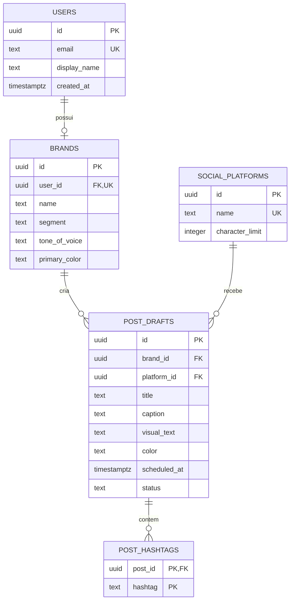

# Banco de Dados - Entrega 3

O PostFlow utiliza **Supabase com PostgreSQL**. A aplicação React acessa o banco pela biblioteca oficial `@supabase/supabase-js`, usando URL e chave publicável configuradas no arquivo `.env`.

## Arquivos

| Arquivo                                 | Responsabilidade                                                  |
| --------------------------------------- | ----------------------------------------------------------------- |
| `schema.sql`                            | Cria tabelas, PKs, FKs, checks, índices, triggers e políticas RLS |
| `seed.sql`                              | Cadastra usuários, marcas, plataformas, posts e hashtags de teste |
| `../src/services/supabaseClient.ts`     | Cria a conexão a partir das variáveis de ambiente                 |
| `../src/services/postFlowRepository.ts` | Implementa o CRUD usado pelas telas                               |
| `../scripts/verify-database.mjs`        | Confirma a conexão e consulta os relacionamentos                  |
| `../scripts/test-supabase-crud.mjs`     | Executa CREATE, READ, UPDATE e DELETE reais                       |

## Configuração no Supabase

1. Crie um projeto gratuito em [supabase.com](https://supabase.com).
2. Abra **SQL Editor** e execute `database/schema.sql`.
3. Execute `database/seed.sql`.
4. Em **Project Settings > Data API**, copie a URL e a chave publicável.
5. Na raiz do PostFlow, copie `.env.example` para `.env` e preencha:

```env
VITE_SUPABASE_URL=https://SEU-PROJETO.supabase.co
VITE_SUPABASE_PUBLISHABLE_KEY=SUA_CHAVE_PUBLICAVEL
```

O `.env` é ignorado pelo Git para evitar o versionamento de configurações locais. A chave utilizada no navegador deve ser apenas a **publishable/anon key**; nunca utilize a `service_role` no frontend.

## Como validar no CMD

```cmd
npm install
npm run db:verify
npm run db:test-crud
npm run dev
```

`db:verify` mostra os registros que a aplicação consegue consultar. `db:test-crud` cria um post temporário, consulta, altera, exclui e confirma a exclusão em cascata das hashtags.

## Modelo Entidade-Relacionamento



## CRUD demonstrável

- **CREATE:** o chat gera um rascunho e o salva em `post_drafts` e `post_hashtags`;
- **READ:** a agenda consulta os posts da marca e seus relacionamentos;
- **UPDATE:** o diálogo da agenda altera título, legenda, data e plataforma;
- **DELETE:** a agenda exclui o post e o PostgreSQL remove suas hashtags em cascata.

## Integridade e segurança

- PKs UUID identificam as entidades;
- FKs mantêm usuário, marca, plataforma, post e hashtag relacionados;
- `ON DELETE CASCADE` remove dados dependentes;
- `ON DELETE RESTRICT` impede excluir uma plataforma em uso;
- `CHECK` valida cor, status, título e hashtag;
- triggers atualizam `updated_at` automaticamente;
- índices atendem consultas por marca, plataforma, data e status;
- RLS limita a chave pública aos dados do usuário acadêmico de demonstração.

As políticas são adequadas à demonstração sem autenticação real. Em produção, devem ser substituídas por políticas baseadas em `auth.uid()` e Supabase Auth.

## Massa de testes

O seed cria 2 usuários, 2 marcas, 3 plataformas, 3 posts e 7 hashtags. A chave pública da aplicação visualiza e altera somente a marca acadêmica `PostFlow Demo`.

## Rastreabilidade

- Jira anterior: `SCRUM-38` - banco relacional e carga inicial;
- Jira atual: [`SCRUM-39`](https://joaovsilva3530.atlassian.net/browse/SCRUM-39) - conexão Supabase e CRUD pela aplicação;
- documentação técnica: Confluence do PostFlow.
