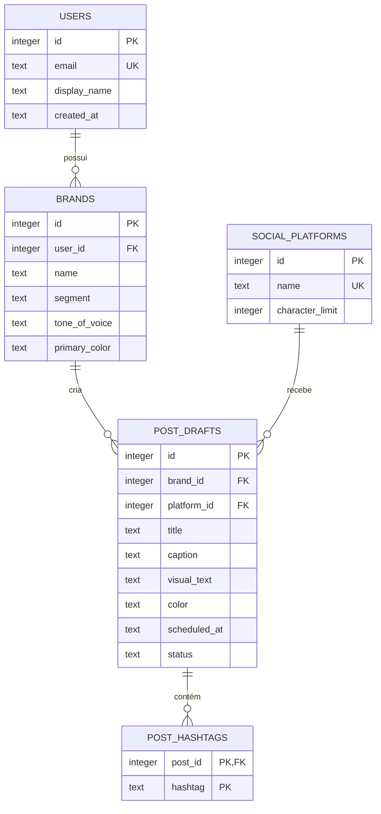

# Banco de Dados — Entrega 3

Esta pasta contém a primeira versão do banco de dados relacional do PostFlow, correspondente à **Entrega 3 — Épico 2, Sprint 1**.

O banco utiliza SQLite porque pode ser executado localmente pelo Node.js sem instalar um servidor adicional. O modelo e os conceitos SQL são relacionais e poderão ser migrados para PostgreSQL quando o backend for implementado.

## Arquivos

| Arquivo                          | Responsabilidade                                  |
| -------------------------------- | ------------------------------------------------- |
| `schema.sql`                     | Cria tabelas, chaves, restrições e índices        |
| `seed.sql`                       | Insere a carga inicial de dados de teste          |
| `postflow.db`                    | Banco gerado localmente; não é versionado         |
| `../scripts/setup-database.mjs`  | Recria o banco e executa schema e seed            |
| `../scripts/verify-database.mjs` | Lista tabelas, registros e relacionamentos        |
| `../scripts/test-database.mjs`   | Valida estrutura, carga e integridade referencial |

## Como executar no CMD

Na pasta principal do projeto:

```cmd
npm install
npm run db:setup
npm run db:verify
```

O primeiro comando instala as dependências do frontend. O segundo cria `database/postflow.db` e carrega os dados. O terceiro apresenta no terminal as tabelas, as quantidades e os posts relacionados.

Para executar todos os testes:

```cmd
npm test
```

## Modelo Entidade-Relacionamento



## Regras implementadas

- Cada marca pertence a um usuário;
- Cada rascunho pertence a uma marca e a uma plataforma;
- Um rascunho pode possuir várias hashtags;
- E-mails e nomes de plataforma não podem se repetir;
- Cores devem seguir o formato hexadecimal `#RRGGBB`;
- O status aceita somente `draft`, `scheduled` ou `published`;
- A exclusão do usuário remove suas marcas, posts e hashtags em cascata;
- Uma plataforma usada por um post não pode ser excluída acidentalmente;
- Índices facilitam consultas por marca, plataforma, data e status.

## Carga inicial

O `seed.sql` cria:

- 2 usuários;
- 2 marcas;
- 3 plataformas;
- 3 rascunhos de posts;
- 7 hashtags.

Os dados são fictícios e servem exclusivamente para validar o modelo e demonstrar a entrega acadêmica.

## Limite deste incremento

O banco está implementado e testado, mas o frontend ainda utiliza `localStorage`. A integração do frontend com uma API e com este banco pertence à etapa de backend prevista nas próximas Sprints.

## Rastreabilidade

- Jira: [SCRUM-38 — Implementar banco de dados relacional e carga inicial](https://joaovsilva3530.atlassian.net/browse/SCRUM-38)
- Commit: deve conter a chave `SCRUM-38`.
